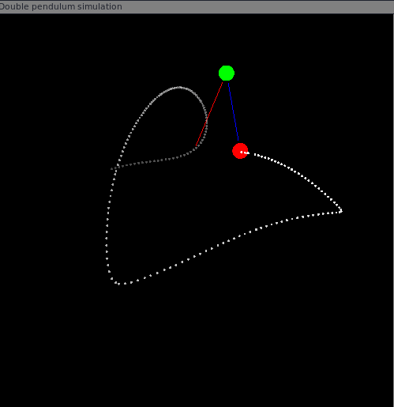

# Double pendulum simulation in Rust programming Language

## Dependencies

You need the wonderfull sfml: (https://www.sfml-dev.org/) library installed in your system

in Archlinux simply:

```bash
sudo pacman -S sfml csfml
```

and the Rust programming language compiler and package mannager (cargo) installed in your system

https://www.rust-lang.org/

## Running the simulation

```bash
cargo run --release
```




## TODO

 - [X] Implement Runge Kutta integrator
 - [ ] Live change parameters(mass, links lengths, ...etc)
